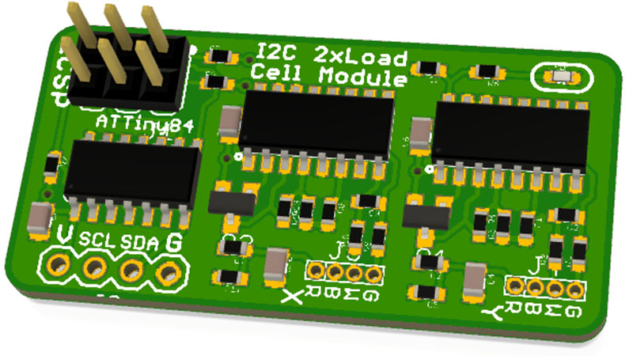

2 x Load Cell I2C Interface
===========================
Copyright 2020 SuperHouse Automation Pty Ltd <www.superhouse.tv>  
Designed by Jonathan Oxer

A pair of load cell amplifiers with an ATTiny84 microcontroller to
provide an I2C interface to the load cells.

Features:

 * 2 x load cell interfaces
 * I2C connection

More information is available at:

  http://www.superhouse.tv/2lci2c

INSTALLATION
------------
The design is saved as an EAGLE project. EAGLE PCB design software is
available from www.cadsoftusa.com free for non-commercial use. To use
this project download it and place the directory containing these files
into the "eagle" directory on your computer. Then open EAGLE and
navigate to the project.

DISTRIBUTION
------------
The specific terms of distribution of this project are governed by the
license referenced below.

LICENSE
-------
Licensed under the TAPR Open Hardware License (www.tapr.org/OHL).
The "license" folder within this repository also contains a copy of
this license in plain text format.
